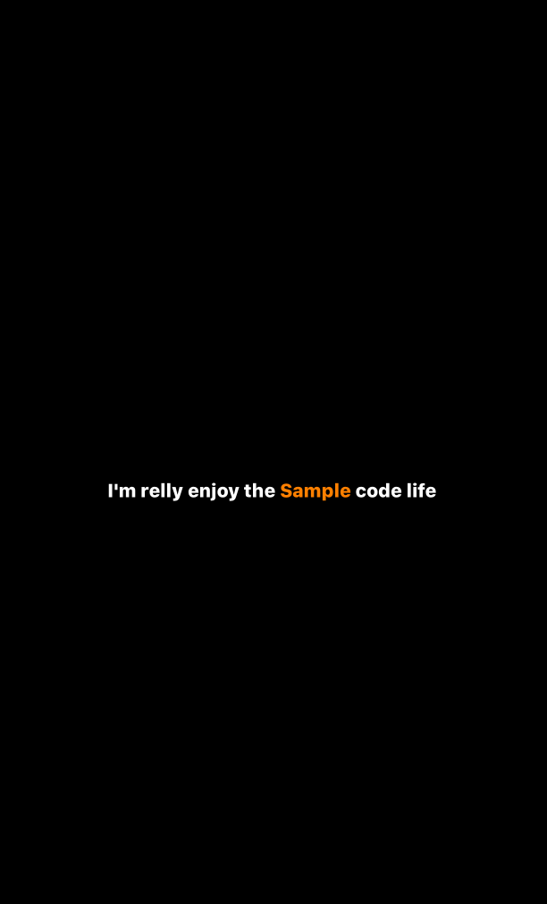

# MAEasyAttributedText

MAEasyAttributedString is a kit, which can help u code attributed string in happy way

Sample
-----



Usage
-----

```objective-c

  MAAttributeSegment *prefix = [[MAAttributeSegment alloc]initFont:[UIFont systemFontOfSize:14.f weight:10.f]
                                                         textColor:[UIColor whiteColor]
                                                              text:@"I'm relly enjoy the"];
  
  MAAttributeSegment *sample = [[MAAttributeSegment alloc]initFont:[UIFont systemFontOfSize:14.f weight:10.f]
                                                         textColor:[UIColor orangeColor]
                                                              text:@" Sample "];
  
  MAAttributeSegment *trail = [[MAAttributeSegment alloc]initFont:[UIFont systemFontOfSize:14.f weight:10.f]
                                                         textColor:[UIColor whiteColor]
                                                              text:@"code life"];
  MAAttributeText *attributedText = [[MAAttributeText alloc]initWithSegments:@[prefix, sample, trail]];
  self.textLabel.attributedText = attributedText.attributedText;
```

Example
-------
	Copyright 2015 Oenius Jou
	
	Licensed under the Apache License, Version 2.0 (the "License");
	you may not use this file except in compliance with the License.
	You may obtain a copy of the License at
	
	    http://www.apache.org/licenses/LICENSE-2.0
	
	Unless required by applicable law or agreed to in writing, software
	distributed under the License is distributed on an "AS IS" BASIS,
	WITHOUT WARRANTIES OR CONDITIONS OF ANY KIND, either express or implied.
	See the License for the specific language governing permissions and
	limitations under the License.
